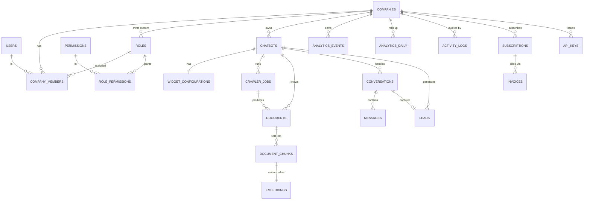

# AI Chatbot SaaS — PostgreSQL Database Design

Production schema for the multi-tenant chatbot platform: **21 tables**, native
PostgreSQL ENUM types, time-range partitioning on the high-volume tables,
trigger-maintained audit fields, soft delete, and **Row-Level Security** for
hard tenant isolation. Every statement in this document is implemented in the
SQLAlchemy models (`app/models/`) and the Alembic migrations
(`alembic/versions/`), and has been applied and tested against PostgreSQL 16.

---

## 1. Design principles

| Principle | Implementation |
|---|---|
| **Multi-tenant safe** | `company_id` discriminator on every tenant table + PostgreSQL RLS policies (`ENABLE` + `FORCE`) keyed off the `app.current_company` session GUC. Deny-by-default when no tenant is set. |
| **Optimized for scale** | Time-range partitioning on `messages`, `analytics_events`, `activity_logs`; pre-aggregated `analytics_daily`; vectors offloaded to Qdrant (Postgres stores only references). |
| **Proper indexing** | Every FK and `company_id` indexed; composite indexes on hot query paths; partial unique indexes for soft-delete-safe uniqueness. |
| **Audit fields** | `created_at` / `updated_at` on all mutable tables (trigger-maintained); append-only tables keep `created_at` only; `activity_logs` is a full audit trail. |
| **Soft delete** | `deleted_at` (nullable) on all mutable entities; uniqueness enforced only among live rows. |
| **Production-ready** | Deterministic constraint naming, native enums, explicit cascade rules, two-role security model, reversible migrations. |

---

## 2. ER diagram



`COMPANIES` is the tenant root. `USERS`, `PERMISSIONS`, and system `ROLES`
(those with `company_id IS NULL`) are global; everything else is tenant-scoped.

---

## 3. Entities & relationships

**Identity & access**
- **users** — global login identity. Not tenant-scoped; joins tenants via memberships.
- **companies** — the tenant. Root of every cascade.
- **company_members** — user↔company join carrying exactly one role and a status (`invited`/`active`/`suspended`).
- **permissions** — global catalog of `resource:action` capabilities.
- **roles** — bundles of permissions. `company_id IS NULL` ⇒ system role (owner/admin/member/viewer, seeded in `0002`); otherwise a tenant's custom role.
- **role_permissions** — role↔permission join.

**Bots & knowledge**
- **chatbots** — a configured assistant (provider/model/generation params, public widget key).
- **widget_configurations** — 1:1 per chatbot: theme, lead-capture, locale, and the `allowed_domains` origin allowlist.
- **crawler_jobs** — website crawls that ingest pages as documents.
- **documents** — an ingested unit (upload / crawl / url / text) with processing `status` and `content_hash`.
- **document_chunks** — retrieval-sized slices; unique per `(document_id, chunk_index)`.
- **embeddings** — 1:1 with a chunk; the system-of-record link to the Qdrant vector (provider/model/dimensions/collection/`vector_id`).

**Chat & conversion**
- **conversations** — a visitor session with a chatbot.
- **messages** — individual turns (`system`/`user`/`assistant`/`tool`); **partitioned by `created_at`**; immutable.
- **leads** — captured contacts, optionally tied 1:1 to the originating conversation; `score` 0–100.

**Analytics, billing, audit**
- **analytics_events** — raw telemetry, **partitioned by `occurred_at`**.
- **analytics_daily** — per-chatbot daily rollup the dashboards read.
- **activity_logs** — append-only audit trail, **partitioned by `created_at`**; `company_id` nullable for platform-level events.
- **subscriptions** — plan state mirrored from the billing provider; one live subscription per company.
- **invoices** — billing documents linked to a subscription.
- **api_keys** — hashed programmatic keys with scopes and expiry/revocation.

---

## 4. Multi-tenancy & Row-Level Security

Isolation is enforced in **three layers**; the database layer is the backstop
that holds even if application code has a bug.

1. **Session GUC** — each request opens a transaction and runs
   `SET LOCAL app.current_company = '<uuid>'` (see `app/db/session.py :: tenant_session`).
2. **RLS policy** — every tenant table has `ENABLE` + `FORCE ROW LEVEL SECURITY`
   and a `tenant_isolation` policy:
   ```sql
   USING      (company_id = NULLIF(current_setting('app.current_company', true), '')::uuid)
   WITH CHECK (company_id = NULLIF(current_setting('app.current_company', true), '')::uuid)
   ```
   If the GUC is unset the expression is `NULL` and **no rows are visible or
   writable** — deny by default. `WITH CHECK` blocks writing rows for another
   tenant. Special cases: `companies` keys on `id`; `roles` allows reading
   system rows via `company_id IS NULL OR company_id = …`.
3. **Application repositories** also filter by `company_id`, and the Qdrant
   payload filter scopes vector search — so the same tenant boundary holds in
   the vector store.

**Two database roles**
- `app_rw` — the normal request role. Subject to RLS (no `BYPASSRLS`).
- `app_admin` — `BYPASSRLS`, used only for pre-tenant bootstrap (login lookup,
  "list my organizations"), billing webhooks, and cross-tenant platform jobs,
  always with an explicit identity filter in code.

`FORCE ROW LEVEL SECURITY` ensures even the table owner is subject to policies,
so RLS cannot be silently bypassed by connecting as the owner.

> Verified: scoped role sees only its tenant's rows; with no GUC set it sees
> zero rows; a cross-tenant `INSERT` is rejected by the policy.

---

## 5. Index strategy

- **Tenant key** — `company_id` is indexed on every tenant table (via `TenantMixin`); it is the leading predicate of nearly every query.
- **Foreign keys** — all FK columns are indexed to keep joins and cascade deletes fast.
- **Composite / covering** — hot read paths get multi-column indexes ordered to match query + sort, e.g.
  `conversations (company_id, chatbot_id, created_at)`,
  `messages (conversation_id, created_at)` and `messages (company_id, created_at)`,
  `analytics_events (company_id, event_type, occurred_at)`,
  `leads (company_id, status)`, `invoices (company_id, status)`.
- **Partial unique (soft-delete safe)** — uniqueness applies only to live rows so a slug/email can be reused after deletion:
  `lower(email) WHERE deleted_at IS NULL` (users),
  `slug WHERE deleted_at IS NULL` (companies, per-tenant for chatbots),
  system-vs-tenant role slugs, one membership per `(company,user)`,
  one lead per conversation, one live subscription per company.
- **Dedup lookups** — `content_hash` on documents and chunks; `vector_id` on embeddings; `key_prefix` on api_keys.
- **Partitioned indexes** — indexes declared on a partitioned parent propagate to every partition automatically.
- **Optional next step** — GIN indexes on the `JSONB`/`metadata` columns if you start filtering inside them at scale.

---

## 6. Foreign keys & cascading rules

| Child → Parent | On delete | Rationale |
|---|---|---|
| *all tenant tables*.`company_id` → companies | **CASCADE** | Hard-deleting a company purges all its data (account closure / GDPR erasure). |
| company_members.user_id → users | CASCADE | Remove memberships when a user is deleted. |
| company_members.role_id → roles | **RESTRICT** | Can't delete a role still assigned to members. |
| company_members.invited_by_id → users | SET NULL | Keep the membership if the inviter is removed. |
| roles.company_id → companies | CASCADE (nullable) | Tenant custom roles die with the tenant; system roles have `NULL`. |
| role_permissions.{role,permission} | CASCADE | Pure join rows. |
| widget_configurations.chatbot_id → chatbots | CASCADE | Config is owned by the bot. |
| crawler_jobs.chatbot_id → chatbots | CASCADE | |
| documents.chatbot_id → chatbots | CASCADE | |
| documents.crawler_job_id → crawler_jobs | SET NULL | Keep documents after the job record is purged. |
| document_chunks.document_id → documents | CASCADE | |
| embeddings.chunk_id → document_chunks | CASCADE | Vector reference dies with the chunk (Qdrant cleanup driven off this). |
| conversations.chatbot_id → chatbots | CASCADE | |
| messages.conversation_id → conversations | CASCADE | |
| leads.chatbot_id → chatbots | CASCADE | |
| leads.conversation_id → conversations | SET NULL | A lead outlives its conversation. |
| analytics_events.chatbot_id → chatbots | SET NULL | Retain history if a bot is deleted. |
| analytics_daily.chatbot_id → chatbots | CASCADE | Rollups are disposable. |
| activity_logs.actor_user_id → users | SET NULL | Preserve the audit record. |
| invoices.subscription_id → subscriptions | SET NULL | Invoices are kept for accounting. |
| api_keys.created_by_id → users | SET NULL | Keep the key if its creator leaves. |

---

## 7. Constraints

- **CHECK** — `chatbots.temperature ∈ [0,2]`, `chatbots.top_k ∈ (0,50]`,
  `messages.feedback ∈ {-1,0,1}`, `leads.score ∈ [0,100]`.
- **UNIQUE** — `users.email` (live, case-insensitive), company/chatbot slugs (live),
  `chatbots.public_key`, `permissions.code`, `permissions(resource,action)`,
  `document_chunks(document_id, chunk_index)`, `embeddings.chunk_id` (1:1),
  `widget_configurations.chatbot_id` (1:1), `leads.conversation_id` (1:1, live),
  `invoices.number`, provider IDs, `api_keys.key_hash`, one live subscription per company.
- **NOT NULL** — `company_id` on all tenant tables (except the deliberately
  nullable `activity_logs.company_id`), plus all business-required columns.
- **Native ENUMs** — 13 types (statuses, roles, channels, etc.) for in-database validation.

---

## 8. Partitioning

`messages`, `analytics_events`, and `activity_logs` are `RANGE`-partitioned by
their time column. Partition keys are part of the composite primary key
(`(id, created_at)` / `(id, occurred_at)`) as PostgreSQL requires. The initial
migration creates a `DEFAULT` partition plus monthly partitions; in production,
schedule monthly partition creation (e.g. **pg_partman**) and detach/archive old
partitions cheaply.

> Verified: rows for July and August land in `messages_2026_07` and
> `messages_2026_08` respectively.

---

## 9. Audit & soft delete

- `created_at` / `updated_at` on every mutable table. `updated_at` is maintained
  by both SQLAlchemy `onupdate` and the `set_updated_at()` **trigger**, so raw
  SQL writes stay correct. Append-only tables (`messages`, `analytics_events`,
  `activity_logs`) carry only `created_at`.
- `deleted_at` marks soft deletion; the application filters `deleted_at IS NULL`,
  and unique indexes are partial on that predicate so identifiers free up on delete.
- `activity_logs` records actor, action, resource, IP, user agent, and a JSON diff.

---

## 10. Running the migrations

```bash
# point Alembic at your DB (sync driver for migrations)
export PYTHONPATH=.
alembic upgrade head        # 0001 schema + 0002 RBAC seed
alembic downgrade base      # full, reversible teardown
```

Migrations run as a role with `CREATE` on schema `public` and (ideally)
`BYPASSRLS` so the seed can insert the company-less system roles. The
application connects as `app_rw` and must set `app.current_company` per request.

**Files**
- `app/db/base.py` — declarative base, naming convention, mixins.
- `app/db/enums.py` — the 13 enum types.
- `app/db/session.py` — async engine + `tenant_session` / `admin_session`.
- `app/models/*.py` — the 21 models grouped by domain.
- `alembic/versions/0001_initial_schema.py` — frozen schema (tables, enums, partitions, triggers, RLS).
- `alembic/versions/0002_seed_rbac.py` — permissions + system roles.
